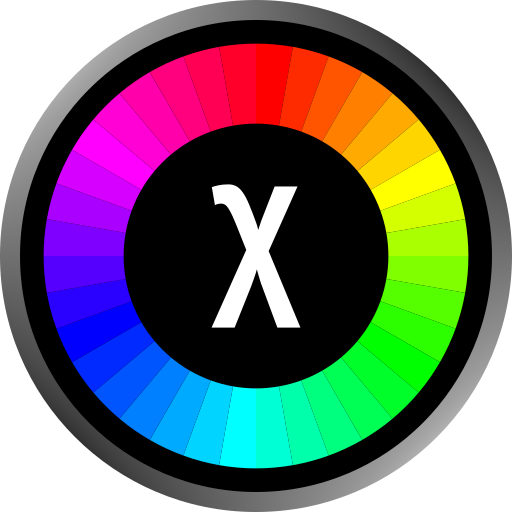

# ColorSort

Sorting algorithms visualizer, inspired by [ArrayV](https://github.com/Gaming32/ArrayV) and similar software.
This software is written in Lua using the LÖVE framework, and is developed mostly for fun.

## Algorithms

There are currently 8 available sorting algorithms:

- Bubble Sort
- Select Sort
- Insert Sort
- Shell Sort
- Quicksort
- Heap Sort
- Merge Sort
- Radix Sort (LSD)

## Libraries

This software uses libraries provided by the LÖVE community, sometimes modified to fit the intended purposes.
Therefore, their modified versions are stored in this repository as well, inside the `lib` folder,
with due credit to their original authors.